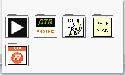

# LabVIEW Usage

The LabVIEW version of ChoreoLib can function as a drop-in replacement of the standard LabVIEW trajectory.  It has limited functionality.  Trajectories can only be read as files created by the offline tool.  They can then be executed using the "Swerve command" or a user written control function.

# Examples

## Load a Trajectory From a File.

# Menu
After installation, a ChoreoLib function palette is added to the WPILIB Third Party menu.

ChoreoLib top palette

ChoreoLib sub palette containing menus for all routines

# Documentation

## ChoreoLib
This function group contains methods for easily loading trajectory files ane executing them on a roboRIO..

**ChoreoLib_Choreo_GetTrajectory**

Load a Choreo trajectory from a file.

There is a menu macro to create most of the user code.

---

**ChoreoLib_Choreo_SwerveCommand**

Command function to execute a Choreo Trajectory.  

There is a menu macro to create most of the user code.

---

