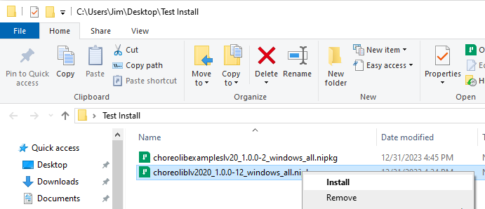
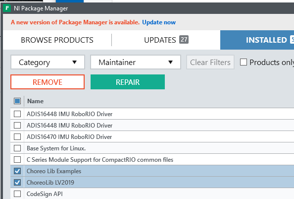
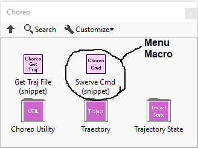
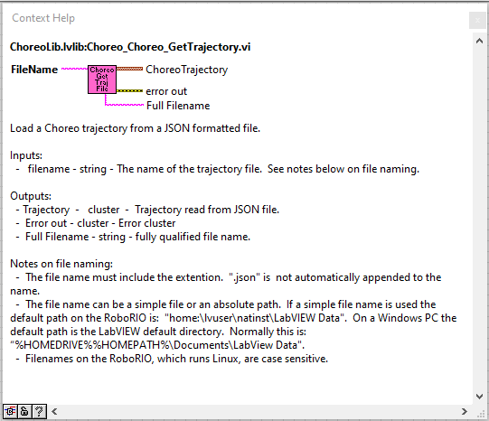
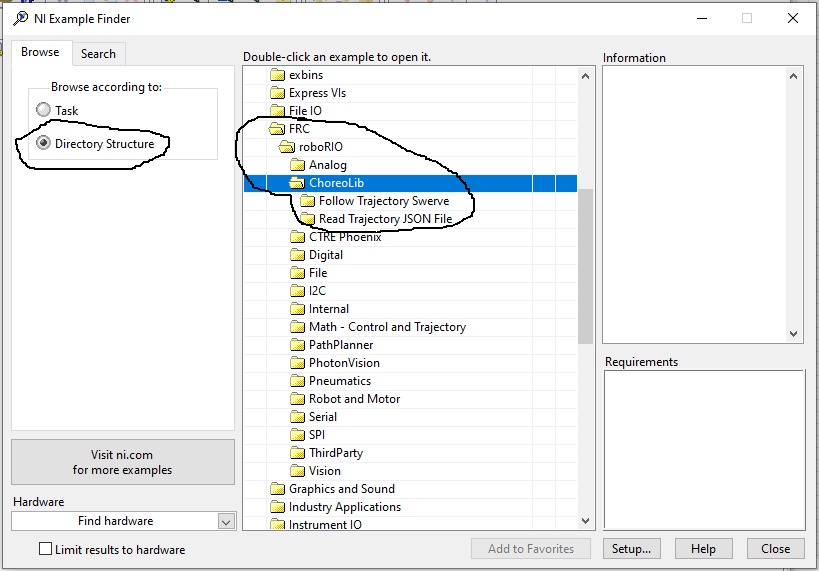

# ChoreoLib LabVIEW Port

This library is port of the Choreo Library to LabVIEW.  The library is used for the First FRC robotics competition.

This repository contains the library and a LabVIEW project used to build the library install package.  It also contains separate projects with test (future) and example programs.

---
## Installs

### Installation

There are a number of prerequisites needed before installing this library.
1. Install the FRC version of LabVIEW.  
1. Install the FRC game tools
1. Install the WPILIB Math LabVIEW Library https://github.com/jsimpso81/WPILIBMathLabVIEW/releases/latest

Download the latest install package.  These can be found in the **Releases** section of the github repository.  Here is a direct link.  https://github.com/jsimpso81/ChoreoLibLabVIEW/releases/latest

Select the *.nipkg* installation file, then double click it, or right click and select install.  Administrative privledges will be needed to perform this installation.  Follow the instructions.  Usually selection of all the default answers is sufficient.  Installation should take 5 minutes or less.

Previous versions do not have to be uninstalled prior to installing a new version.  The new version will automatically upgrade the older version.

### Removal

To uninstall, open NI Package Manager.  Select the *Installed* tab.  Find and highlight  **ChoreoLibLabVIEW**.  Then click the *REMOVE* button.  The uninstall should start. It should take 5 minutes or less.

---
## Library Summary

The library includes a collection of subVIs that can be used in robot programs.  Generally only two main VIs will be needed:
- Get Trajectory (Read trajectory file)
- Swerve Command (Execute trajectory)

### Menus
 
Menu items for all the subVI's are included as part of the standard LabVIEW WPI Robotics Library menu

### Menu Macros
 
Menu Macros place entire snippets of code into a VI.  This greatly speeds development, by eliminating many tasks of adding a function call to your code.

### Help

Each VI includes help that can be accessed using the standard LabVIEW help toggle (Ctrl H).

### Reference Manual
In addition to help for each individual function VI, a separate PDF document contains all the documentation.  A link to this document is placed on the public desktop, so it is accessible by all useers.

### Examples

A separately installed package includes a number of examples using this library.  They are added to the LabVIEW Find Examples collection.

---
## Reporting Issues

Use the github issues menu to submit information on issues and suggested enhancements.  
I'll attempt to deal with issues in a reasonable time, but there are no guarantees.

When submitting an issue, please follow these guidelines:
- Make certain you are using the latest version of the library.  If not, install the latest version and see if the issue still occurs.
- See if the issue has already been reported.  If so, add any new details to the existing issue.
- Write a very detailed specific description of the problem.
- Include any screen shots or other data needed to show the issue.
- Describe exactly how to reproduce the error.  (Likely, I can't try this on your robot...)
- If possible, try and condense the problem to a small test program that isolates the issue.
- If you found a work around, please include it for others to use.
See  for additional details.

---
## Contributing

Contributions of enhancements, bug fixes, and new routines are welcome.  If new routines are not already part of the C++/Java WPILIB, then it seems fair that they 
should be written solely by FRC student members, with confirmation from a mentor on their team to be able to be candidates for inclusion.  
See  for additional details.

---
File last updated: 12/27/2023
